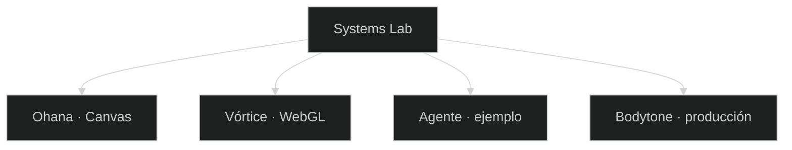
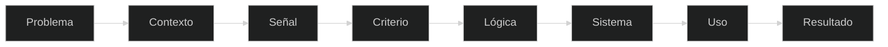

 

  

  

**No te lo explico. Púlsalo.**

Si no se abre en el navegador, no está.

 

[Español](#español) · [English](#english)

---

## Lo que se abre

| | Qué es | Estado |
| --- | --- | --- |
| [Ohana](https://gracianb.github.io/project-ohana/) | Canvas 2D. Isla Hoku. 10 salas, 10 personajes, de bebé a GOD. | Live |
| [Vórtice](https://vortex-gilt-xi.vercel.app/) | WebGL. Mueves el cursor. Los puntos te siguen. | Live |
| [Bodytone](https://bodytonehelp.zendesk.com/hc/es) | Help Center público. El cliente elige, el caso llega con contexto. | Producción |
| [Agente](https://gracianb.github.io/systems-lab/#agente) | Cómo se siente un canal con agente. Sin claves. | Ejemplo |

### [Abrir Systems Lab](https://gracianb.github.io/systems-lab/)

---

## Español

Systems Lab es la puerta técnica de [GracianB](https://gracianb.github.io/GracianB/). No es una lista de frameworks. Es el sitio donde una idea se construye, se rompe y, si aguanta, se publica.

Idea, prototipo, prueba, rotura, arreglo, publicación. La iteración no es un fallo del proceso. Es el proceso.

La tecnología es el medio. El sistema es el producto. Me interesa menos «sé usar esto» que «sé convertir un problema en un sistema que usa esto».

### Ohana

Un platformer de Canvas, en el navegador, sin instalar nada. Isla Hoku. Diez personajes originales, cada uno con su golpe y sus tres poderes. Cinco formas, de bebé a GOD. Diez salas. Al final, la Reina del Nido.

La H pega. J, K y L son el poder. La partida recuerda la sala y la forma.

[Jugar Ohana](https://gracianb.github.io/project-ohana/)

### Vórtice

Un campo WebGL. No es una captura: el cursor mueve el sistema.

[Abrir Vórtice](https://vortex-gilt-xi.vercel.app/)

### Bodytone

Aquí el laboratorio toca un sistema de verdad. El Help Center está en producción, sobre Zendesk.

El cliente entra, dice qué necesita, el sistema enruta, el caso aterriza con contexto. Nadie le pide que cuente la historia dos veces.

Canal, criterio, acción, cierre.

[Entrar al Help Center](https://bodytonehelp.zendesk.com/hc/es)

El relato profesional está en el [deck](https://gracianb.github.io/professional-deck/), no aquí.

### El agente

Abajo en el lab hay un agente de ejemplo: envío, factura, ticket, un archivo. Enseña la interfaz y el estado. No lleva claves. No es el sistema de Bodytone. El de verdad es el Help Center.

[Ver el ejemplo](https://gracianb.github.io/systems-lab/#agente)

### Cómo está hecho el lab

HTML, CSS y JavaScript, sin framework. Español e inglés. Claro y oscuro. Fraunces, Inter, JetBrains Mono. El acento de Play es `#7AF3FF`. Publicado en GitHub Pages.

Ohana es Canvas. Vórtice es WebGL, en Vercel. Bodytone es Zendesk.

| Capa | |
| --- | --- |
| Lo que se ve | HTML, CSS, la interfaz |
| Lo que decide | Estado, reglas, enrutado |
| Cuando hay modelo | GenAI, con una persona que cierra |
| Cuando es un juego | Canvas o WebGL |
| Cuando es soporte | Zendesk |

Un sistema que nadie usa es ingeniería con autoestima.

### Las otras puertas

| | |
| --- | --- |
| 00 | [Hub](https://gracianb.github.io/GracianB/) · personas, datos, sistemas |
| 01 | [Deck](https://gracianb.github.io/professional-deck/) · Customer Success, datos, el caso Bodytone |
| 03 | [Yoga](https://gracianb.github.io/yoga-instructor/) · presencia, respiración, práctica |

Mismo ecosistema. Otra frecuencia. La línea profesional —cliente, datos, pricing, automatización, IA, sistemas— se cuenta en el deck. Este repo solo enseña lo que se puede pulsar.

---

## English

Systems Lab is the technical door of [GracianB](https://gracianb.github.io/GracianB/). Not a list of frameworks. The place where an idea is built, broken, and shipped if it holds.

Technology is the medium. The system is the product.

| | What it is | Status |
| --- | --- | --- |
| [Ohana](https://gracianb.github.io/project-ohana/) | Canvas 2D. Isla Hoku. 10 rooms, 10 characters, from baby to GOD. H hits. J, K and L are the powers. | Live |
| [Vórtice](https://vortex-gilt-xi.vercel.app/) | WebGL. Move the cursor. The points follow. | Live |
| [Bodytone](https://bodytonehelp.zendesk.com/hc/es) | Public Help Center. The customer chooses. The case lands with context. | Production |
| [Agent](https://gracianb.github.io/systems-lab/#agente) | How a channel feels with an agent. No keys. Not Bodytone. | Example |

The lab itself is HTML, CSS and JavaScript, Spanish and English, light and dark. Ohana is Canvas. Vórtice is WebGL on Vercel. Bodytone is Zendesk. The professional write-up lives in the [deck](https://gracianb.github.io/professional-deck/). Yoga is the [third door](https://gracianb.github.io/yoga-instructor/). The three meet at the [hub](https://gracianb.github.io/GracianB/).

A system nobody uses is engineering with an ego.

---

  

[Lab](https://gracianb.github.io/systems-lab/) · [Ohana](https://gracianb.github.io/project-ohana/) · [Vórtice](https://vortex-gilt-xi.vercel.app/) · [Hub](https://gracianb.github.io/GracianB/)

 

Murcia · 2026

