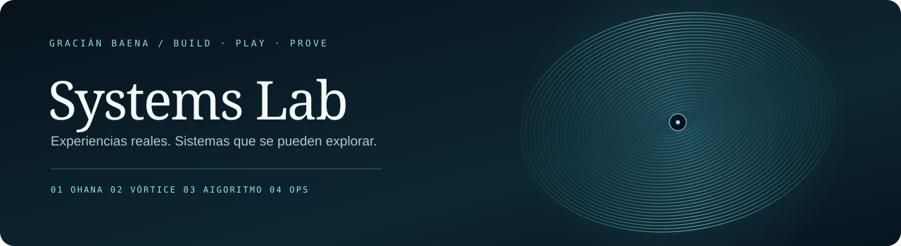
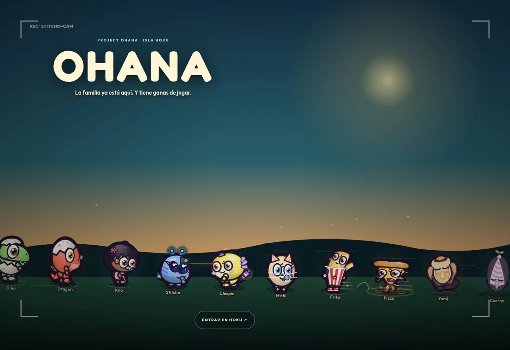
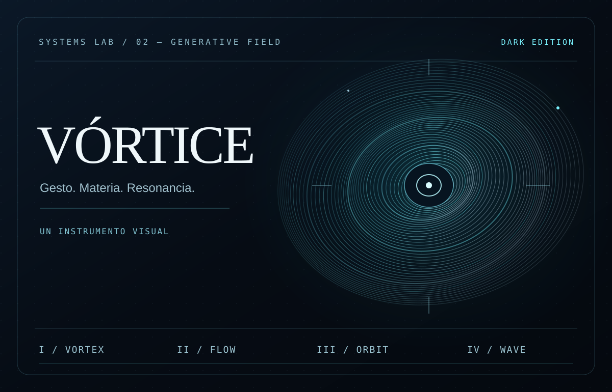
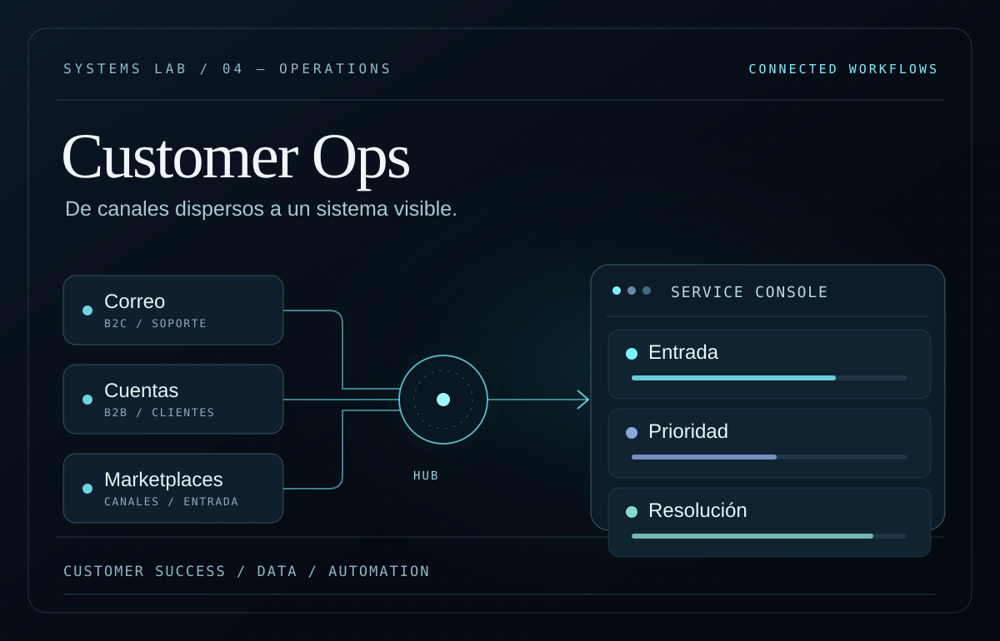

<div align="center">

<a href="https://gracianb.github.io/systems-lab/">
  
</a>

# Systems Lab

**Juegos · Arte generativo · IA aplicada · Customer Operations**

Una colección de proyectos que puedes **abrir, experimentar y comprobar**. Menos promesas, más producto.

[**Explorar el laboratorio ↗**](https://gracianb.github.io/systems-lab/) · [Modo claro ↗](https://gracianb.github.io/systems-lab/?theme=light) · [Portafolio principal ↗](https://gracianb.github.io/GracianB/)

</div>

---

## Empieza por una experiencia

<table>
<tr>
<td width="50%" valign="top">
<a href="https://gracianb.github.io/project-ohana/"></a>

<h3><a href="https://gracianb.github.io/project-ohana/">OHANA ↗</a></h3>
<p><strong>Juega.</strong> Un mundo con diez personajes, evolución, salas y combate. <a href="https://github.com/GracianB/project-ohana">Código</a>.</p>
</td>
<td width="50%" valign="top">
<a href="https://vortex-gilt-xi.vercel.app/"></a>

<h3><a href="https://vortex-gilt-xi.vercel.app/">Vórtice ↗</a></h3>
<p><strong>Experimenta.</strong> Campo WebGL con cuatro movimientos y estados visuales configurables. <a href="https://github.com/GracianB/vortex">Código</a>.</p>
</td>
</tr>
</table>

<table>
<tr>
<td width="50%" valign="top">
<a href="https://gracianb.github.io/systems-lab/#aigoritmo"></a>

<h3><a href="https://gracianb.github.io/systems-lab/#aigoritmo">Aigoritmo · Showcase ↗</a></h3>
<p><strong>Descubre.</strong> Cuatro identidades: Llama, Qwen, Arcana y Arcano. La app es <strong>privada y local</strong>; la web muestra una presentación visual, no una API ni un chat público.</p>
</td>
<td width="50%" valign="top">
<a href="https://gracianb.github.io/systems-lab/#cs"></a>

<h3><a href="https://gracianb.github.io/systems-lab/#cs">Customer Operations ↗</a></h3>
<p><strong>Resuelve.</strong> Caso real de operaciones de soporte y una <strong>simulación local con datos ficticios</strong>. <a href="https://bodytonehelp.zendesk.com/hc/es">Help Center de referencia</a>.</p>
</td>
</tr>
</table>

**También:** [RevOps Studio · demo con datos de ejemplo ↗](https://gracianb.github.io/revops-studio/demo.html). Cutter Studio sigue siendo una herramienta privada, no una demo pública.

## Cómo está construido

| Capa | Implementación |
| --- | --- |
| Sitio | HTML, CSS y JavaScript sin framework; ES/EN; temas claro/oscuro |
| Experiencias | Enlaces directos y carga optativa del iframe de Vórtice y del agente |
| Visual | Campo Canvas con reducción de movimiento y posters específicos por tema |
| Calidad | Node 24, pruebas de contrato, Playwright (Chromium, Firefox, WebKit), comprobaciones de accesibilidad y presupuestos |
| Publicación | GitHub Actions → `dist/` → GitHub Pages; sin publicar código privado |

```bash
npm ci
npm run check
npm run test:browser
npm run build
```

Para ejecutar localmente: `npm start` (normalmente [127.0.0.1:4173](http://127.0.0.1:4173/)).

## Documentación, sin duplicar la portada

[**Arquitectura y estructura**](docs/ARCHITECTURE.md) · [**Calidad y límites de las demos**](docs/QUALITY_AND_BOUNDARIES.md) · [**Releases y decisiones**](docs/RELEASES.md) · [**Configuración GitHub**](docs/GITHUB_CONFIGURATION.md) · [**Seguridad**](SECURITY.md) · [**Historial**](CHANGELOG.md) · [**Acciones CI**](https://github.com/GracianB/systems-lab/actions)

<sub>El código público permite inspeccionar el escaparate. Aigoritmo y Cutter no se publican aquí, ni sus claves, modelos o datos locales. Los despliegues externos se mantienen de forma independiente.</sub>
